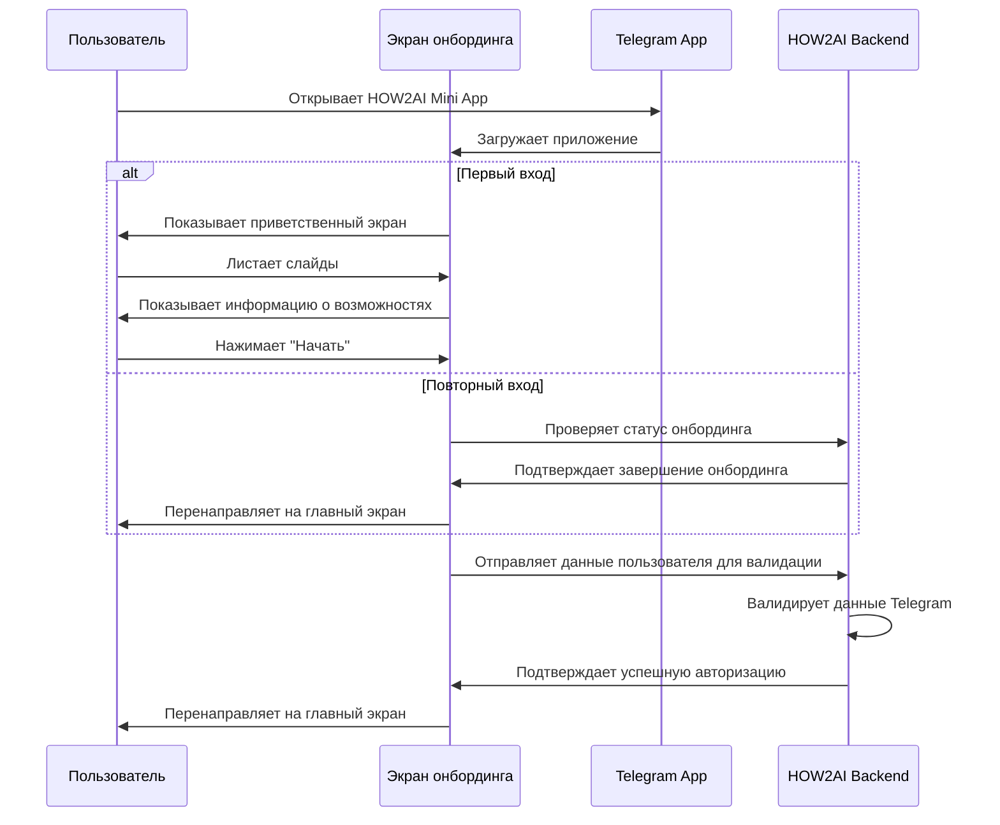
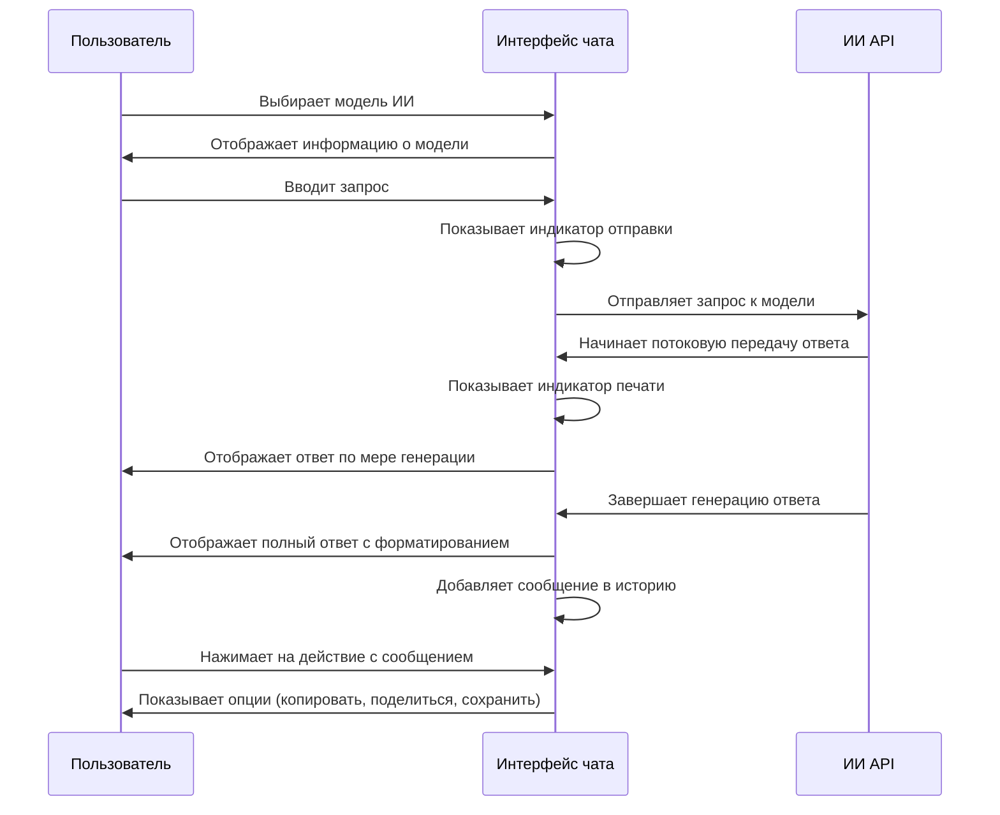
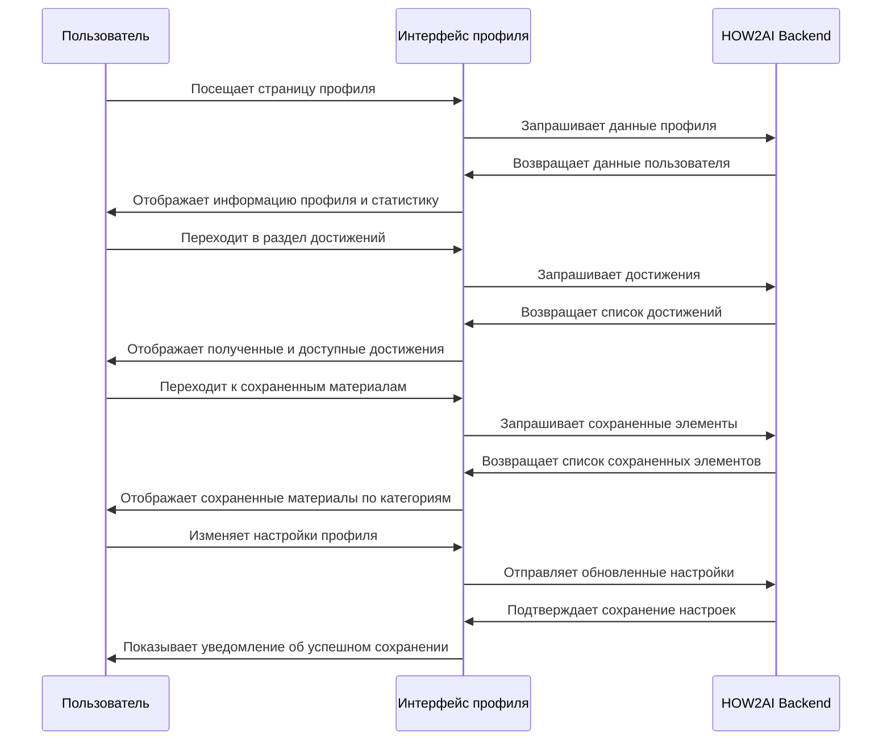

# HOW2AI Telegram Mini App - Разработка UI/UX и компонентов

## 1. Карта экранов и навигация

### 1.1 Основные экраны приложения

```mermaid
flowchart TD
    A[Стартовый экран / Онбординг] --> B[Главный экран]
    
    B --> C[Лаборатория ИИ]
    B --> D[Образовательные ресурсы]
    B --> E[Каталог компаний и моделей]
    B --> F[Сообщество]
    B --> G[Профиль пользователя]
    
    C --> C1[Чат с ИИ]
    C --> C2[Генерация изображений]
    C --> C3[Текстовая генерация]
    
    D --> D1[Курсы]
    D --> D2[Библиотека ресурсов]
    D --> D3[Визуализации ИИ]
    
    E --> E1[Список компаний]
    E --> E2[Каталог моделей]
    E --> E3[Сравнение моделей]
    
    F --> F1[Форум]
    F --> F2[Галерея результатов]
    F --> F3[Активные обсуждения]
    
    G --> G1[Личная информация]
    G --> G2[Достижения]
    G --> G3[Сохраненные материалы]
    G --> G4[Настройки]
    
    B --> H[Админ-панель]
    H --> H1[Управление пользователями]
    H --> H2[Управление контентом]
    H --> H3[Настройки приложения]
    H --> H4[Коммуникации]
    
    style A fill:#FF5722,stroke:#D84315,color:white
    style B fill:#5D4037,stroke:#3E2723,color:white
    style C,D,E,F,G,H fill:#4CAF50,stroke:#2E7D32,color:white
    style C1,C2,C3,D1,D2,D3,E1,E2,E3,F1,F2,F3,G1,G2,G3,G4,H1,H2,H3,H4 fill:#2196F3,stroke:#1565C0,color:white
```



### 1.2 Структура навигации

- **Нижняя навигационная панель** для основных разделов (мобильный вид)
- **Кнопка "Назад"** в верхнем левом углу, интегрированная с Telegram BackButton API
- **Навигационная цепочка** (breadcrumbs) для вложенных страниц
- **Боковое меню** с расширенной навигацией (опционально для десктопа)
- **Контекстная навигация** внутри разделов

## 2. Детализация основных экранов

### 2.1 Стартовый экран и онбординг

#### 2.1.1 Элементы интерфейса

- **Приветственный экран** с логотипом HOW2AI и кратким описанием
- **Слайды с ключевыми возможностями** (3-4 слайда)
- **Кнопка "Начать"** с интеграцией с Telegram MainButton
- **Индикаторы прогресса** для слайдов
- **Опция "Пропустить"** для возврата пользователей

#### 2.1.2 Сценарий взаимодействия



### 2.2 Главный экран

#### 2.2.1 Элементы интерфейса

- **Приветствие пользователя** с именем и фото профиля
- **Карточки быстрого доступа** к основным разделам
- **Последние активности** и рекомендации
- **Раздел "В тренде"** с популярными темами/моделями ИИ
- **Прогресс обучения** с визуализацией достижений
- **Нижняя навигационная панель** для основных разделов

#### 2.2.2 Компоненты

- `WelcomeHeader` – приветствие с именем и аватаром пользователя
- `QuickAccessCard` – карточка с быстрым доступом к функциям
- `ActivityFeed` – лента последней активности
- `TrendingTopics` – актуальные темы и новости
- `LearningProgress` – индикатор прогресса обучения
- `BottomNavigation` – основная навигация приложения

### 2.3 Лаборатория ИИ

#### 2.3.1 Общая структура лаборатории

- **Список инструментов** с описанием и иконками
- **Последние эксперименты** пользователя
- **Рекомендованные промпты** и шаблоны
- **Переключение между инструментами** с сохранением состояния

#### 2.3.2 Чат с ИИ

**Элементы интерфейса:**
- **Выбор модели** с карточками и описанием возможностей
- **История сообщений** с поддержкой различных типов контента
- **Поле ввода сообщения** с опциями форматирования
- **Настройки параметров модели** (температура, токены и т.д.)
- **Индикаторы активности** (печатает, обрабатывает)

**Компоненты:**
- `ModelSelector` – выбор языковой модели
- `ChatMessageList` – список сообщений с поддержкой различных типов
- `MessageInput` – поле ввода с кнопками быстрых действий
- `ModelSettings` – настройки параметров генерации
- `TypingIndicator` – индикатор активности модели

**Взаимодействие:**



#### 2.3.3 Генерация изображений

**Элементы интерфейса:**
- **Поле ввода промпта** с подсказками и примерами
- **Настройки генерации** (размер, стиль, количество)
- **Предпросмотр результатов** с опциями сохранения/редактирования
- **Галерея сгенерированных изображений**
- **Режимы редактирования** (рисование, инпеинтинг, аутпеинтинг)

**Компоненты:**
- `PromptInput` – поле ввода текстового описания
- `ImageGenerationSettings` – настройки параметров генерации
- `ImagePreview` – предпросмотр с действиями
- `GenerationHistory` – история сгенерированных изображений
- `EditingTools` – инструменты для редактирования изображений

### 2.4 Образовательные ресурсы

#### 2.4.1 Курсы

**Элементы интерфейса:**
- **Карточки курсов** с прогрессом и описанием
- **Фильтрация** по уровню сложности и тематике
- **Модули курса** с интерактивными элементами
- **Тесты и задания** для проверки знаний
- **Сертификаты по завершении** курса

**Компоненты:**
- `CourseCard` – карточка курса с информацией и прогрессом
- `CourseFilter` – фильтры для поиска курсов
- `ModuleList` – список модулей курса с статусом прохождения
- `LessonContent` – содержимое урока с интерактивными элементами
- `AssessmentModule` – модуль тестирования и оценки знаний

#### 2.4.2 Библиотека ресурсов

**Элементы интерфейса:**
- **Категории ресурсов** с визуальным представлением
- **Поиск по ключевым словам** и тегам
- **Фильтры по типу** (статьи, видео, инструменты)
- **Карточки ресурсов** с предпросмотром и метаданными
- **Возможность сохранения** и добавления в избранное

**Компоненты:**
- `ResourceCategories` – категории ресурсов
- `SearchBar` – строка поиска с автодополнением
- `ResourceFilters` – фильтры по различным параметрам
- `ResourceCard` – карточка ресурса с информацией
- `SaveButton` – кнопка сохранения в личную коллекцию

### 2.5 Профиль пользователя

#### 2.5.1 Элементы интерфейса

- **Информация профиля** с данными Telegram
- **Статистика активности** и использования приложения
- **Раздел достижений** с бейджами и прогрессом
- **Сохраненные материалы** по категориям
- **Настройки** персонализации и предпочтений

#### 2.5.2 Компоненты

- `ProfileHeader` – заголовок профиля с основной информацией
- `UserStats` – статистика использования приложения
- `AchievementGallery` – галерея достижений и наград
- `SavedItemsList` – список сохраненных материалов
- `PreferencesSettings` – настройки пользовательских предпочтений

#### 2.5.3 Взаимодействие



## 3. Общие компоненты и элементы UI

### 3.1 Навигационные компоненты

#### 3.1.1 Нижняя навигация

```typescript
interface BottomNavigationProps {
  activeItem: string;
  onItemChange: (item: string) => void;
}

const BottomNavigation: React.FC<BottomNavigationProps> = ({
  activeItem,
  onItemChange
}) => {
  const items = [
    { id: 'home', icon: <HomeIcon />, label: 'Главная' },
    { id: 'laboratory', icon: <LabIcon />, label: 'Лаборатория' },
    { id: 'education', icon: <EducationIcon />, label: 'Обучение' },
    { id: 'community', icon: <CommunityIcon />, label: 'Сообщество' },
    { id: 'profile', icon: <ProfileIcon />, label: 'Профиль' }
  ];
  
  return (
    <nav className="fixed bottom-0 left-0 right-0 bg-[#1A1F2C] border-t border-gray-800">
      <div className="flex justify-between items-center px-2">
        {items.map(item => (
          <button
            key={item.id}
            className={`py-2 px-3 flex flex-col items-center ${
              activeItem === item.id ? 'text-blue-400' : 'text-gray-400'
            }`}
            onClick={() => onItemChange(item.id)}
          >
            <div className="text-xl">{item.icon}</div>
            <span className="text-xs mt-1">{item.label}</span>
          </button>
        ))}
      </div>
    </nav>
  );
};
```

#### 3.1.2 Кнопка "Назад" в интеграции с Telegram

```typescript
interface BackButtonProps {
  onBack?: () => void;
  title?: string;
}

const BackButton: React.FC<BackButtonProps> = ({ onBack, title }) => {
  const { webApp, isInitialized } = useTelegramApp();
  
  useEffect(() => {
    if (isInitialized && webApp) {
      webApp.BackButton.show();
      
      const handleBackButton = () => {
        if (onBack) {
          onBack();
        } else {
          // Fallback navigation
          window.history.back();
        }
      };
      
      webApp.BackButton.onClick(handleBackButton);
      
      return () => {
        webApp.BackButton.offClick(handleBackButton);
        webApp.BackButton.hide();
      };
    }
  }, [isInitialized, webApp, onBack]);
  
  return (
    <div className="flex items-center h-12 px-4">
      <button 
        className="flex items-center text-gray-300 hover:text-white"
        onClick={onBack || (() => window.history.back())}
      >
        <ChevronLeftIcon className="w-5 h-5 mr-1" />
        <span className="text-sm">{title || 'Назад'}</span>
      </button>
    </div>
  );
};
```

### 3.2 Карточки и контейнеры

#### 3.2.1 Универсальная карточка

```typescript
interface CardProps {
  title?: string;
  description?: string;
  image?: string;
  onClick?: () => void;
  badge?: string;
  footer?: React.ReactNode;
  className?: string;
  children?: React.ReactNode;
}

const Card: React.FC<CardProps> = ({
  title,
  description,
  image,
  onClick,
  badge,
  footer,
  className,
  children
}) => {
  return (
    <div 
      className={`bg-[#1A1F2C] rounded-lg overflow-hidden shadow-md ${
        onClick ? 'cursor-pointer hover:bg-[#232936] transition' : ''
      } ${className || ''}`}
      onClick={onClick}
    >
      {image && (
        <div className="h-40 overflow-hidden relative">
          
          {badge && (
            <div className="absolute top-2 right-2 bg-blue-500 text-white text-xs px-2 py-1 rounded-full">
              {badge}
            </div>
          )}
        </div>
      )}
      <div className="p-4">
        {title && <h3 className="font-bold text-lg mb-1">{title}</h3>}
        {description && <p className="text-gray-300 text-sm">{description}</p>}
        {children}
      </div>
      {footer && <div className="border-t border-gray-700 p-3">{footer}</div>}
    </div>
  );
};
```

#### 3.2.2 Контейнер разделов

```typescript
interface SectionContainerProps {
  title?: string;
  description?: string;
  action?: React.ReactNode;
  className?: string;
  children: React.ReactNode;
}

const SectionContainer: React.FC<SectionContainerProps> = ({
  title,
  description,
  action,
  className,
  children
}) => {
  return (
    <section className={`mb-6 ${className || ''}`}>
      {(title || action) && (
        <div className="flex justify-between items-center mb-3">
          <div>
            {title && <h2 className="text-lg font-bold">{title}</h2>}
            {description && <p className="text-sm text-gray-400">{description}</p>}
          </div>
          {action}
        </div>
      )}
      {children}
    </section>
  );
};
```

### 3.3 Интерактивные элементы

#### 3.3.1 Главная кнопка действия (MainButton)

```typescript
interface MainButtonProps {
  text: string;
  onClick: () => void;
  color?: string;
  textColor?: string;
  isVisible?: boolean;
  isActive?: boolean;
  isLoading?: boolean;
}

const MainButton: React.FC<MainButtonProps> = ({
  text,
  onClick,
  color = '#3B82F6',
  textColor = '#FFFFFF',
  isVisible = true,
  isActive = true,
  isLoading = false
}) => {
  const { webApp, isInitialized } = useTelegramApp();
  
  useEffect(() => {
    if (isInitialized && webApp) {
      webApp.MainButton.setParams({
        text,
        color,
        text_color: textColor,
        is_active: isActive,
        is_visible: isVisible
      });
      
      webApp.MainButton.onClick(onClick);
      
      if (isLoading) {
        webApp.MainButton.showProgress();
      } else {
        webApp.MainButton.hideProgress();
      }
      
      return () => {
        webApp.MainButton.offClick(onClick);
        webApp.MainButton.hide();
      };
    }
  }, [isInitialized, webApp, text, color, textColor, isVisible, isActive, isLoading, onClick]);
  
  // Возвращаем запасной вариант кнопки для случаев, когда Telegram API недоступен
  if (!isInitialized || !webApp) {
    return (
      <button
        className={`w-full py-3 rounded-lg font-medium ${
          isActive ? '' : 'opacity-50 cursor-not-allowed'
        }`}
        style={{ backgroundColor: color, color: textColor }}
        onClick={isActive ? onClick : undefined}
        disabled={!isActive || isLoading}
      >
        {isLoading ? 'Загрузка...' : text}
      </button>
    );
  }
  
  // В случае с Telegram Mini App возвращаем null, так как кнопка отображается нативно
  return null;
};
```

#### 3.3.2 Модальное окно

```typescript
interface ModalProps {
  isOpen: boolean;
  onClose: () => void;
  title?: string;
  children: React.ReactNode;
  footer?: React.ReactNode;
  showCloseButton?: boolean;
  fullScreen?: boolean;
}

const Modal: React.FC<ModalProps> = ({
  isOpen,
  onClose,
  title,
  children,
  footer,
  showCloseButton = true,
  fullScreen = false
}) => {
  const { webApp, isInitialized } = useTelegramApp();
  
  useEffect(() => {
    if (isInitialized && webApp && isOpen) {
      // Включаем подтверждение закрытия
      webApp.enableClosingConfirmation();
      
      return () => {
        webApp.disableClosingConfirmation();
      };
    }
  }, [isInitialized, webApp, isOpen]);
  
  if (!isOpen) return null;
  
  return (
    <div className="fixed inset-0 z-50 flex items-center justify-center">
      <div 
        className="absolute inset-0 bg-black bg-opacity-70"
        onClick={onClose}
      />
      <div 
        className={`
          relative z-10 bg-[#1A1F2C] rounded-lg overflow-hidden shadow-xl
          ${fullScreen ? 'w-full h-full' : 'w-11/12 max-w-lg max-h-[90vh]'}
        `}
      >
        {title && (
          <div className="flex items-center justify-between px-4 py-3 border-b border-gray-700">
            <h3 className="font-bold">{title}</h3>
            {showCloseButton && (
              <button 
                className="text-gray-400 hover:text-white"
                onClick={onClose}
              >
                <XIcon className="w-5 h-5" />
              </button>
            )}
          </div>
        )}
        <div className="overflow-y-auto p-4">
          {children}
        </div>
        {footer && (
          <div className="border-t border-gray-700 px-4 py-3">
            {footer}
          </div>
        )}
      </div>
    </div>
  );
};
```

## 4. Компоненты геймификации

### 4.1 Индикатор прогресса и уровня

```typescript
interface ProgressLevelProps {
  currentXP: number;
  levelXP: number;
  level: number;
  progress: number;
}

const ProgressLevel: React.FC<ProgressLevelProps> = ({
  currentXP,
  levelXP,
  level,
  progress
}) => {
  return (
    <div className="bg-[#1A1F2C] rounded-lg p-4">
      <div className="flex justify-between mb-2">
        <div>
          <span className="text-sm text-gray-400">Уровень</span>
          <div className="text-xl font-bold">{level}</div>
        </div>
        <div className="text-right">
          <span className="text-sm text-gray-400">Опыт</span>
          <div className="text-xl font-bold">{currentXP}/{levelXP}</div>
        </div>
      </div>
      
      <div className="h-3 bg-gray-700 rounded-full overflow-hidden">
        <div 
          className="h-full bg-blue-500 rounded-full transition-all duration-300"
          style={{ width: `${progress}%` }}
        />
      </div>
      
      <div className="mt-2 text-sm text-gray-400 flex justify-between">
        <span>Текущий уровень</span>
        <span>До следующего уровня: {levelXP - currentXP} XP</span>
      </div>
    </div>
  );
};
```

### 4.2 Достижения

```typescript
interface Achievement {
  id: string;
  title: string;
  description: string;
  icon: React.ReactNode;
  progress?: number;
  maxProgress?: number;
  unlocked: boolean;
  unlockedAt?: Date;
}

interface AchievementCardProps {
  achievement: Achievement;
  onClick?: (id: string) => void;
}

const AchievementCard: React.FC<AchievementCardProps> = ({
  achievement,
  onClick
}) => {
  const {
    id,
    title,
    description,
    icon,
    progress,
    maxProgress,
    unlocked,
    unlockedAt
  } = achievement;
  
  const handleClick = () => {
    if (onClick) onClick(id);
  };
  
  return (
    <div 
      className={`
        bg-[#1A1F2C] rounded-lg p-4 cursor-pointer
        ${unlocked ? 'border-2 border-blue-500' : 'border border-gray-700 opacity-70'}
      `}
      onClick={handleClick}
    >
      <div className="flex items-center mb-3">
        <div className={`
          p-2 rounded-full mr-3
          ${unlocked ? 'bg-blue-500' : 'bg-gray-700'}
        `}>
          {icon}
        </div>
        <div>
          <h3 className="font-bold">{title}</h3>
          {unlocked && unlockedAt && (
            <span className="text-xs text-gray-400">
              Получено {new Date(unlockedAt).toLocaleDateString()}
            </span>
          )}
        </div>
      </div>
      
      <p className="text-sm text-gray-300 mb-2">{description}</p>
      
      {(progress !== undefined && maxProgress) && (
        <div>
          <div className="flex justify-between text-xs text-gray-400 mb-1">
            <span>Прогресс</span>
            <span>{progress}/{maxProgress}</span>
          </div>
          <div className="h-2 bg-gray-700 rounded-full overflow-hidden">
            <div 
              className={`h-full rounded-full transition-all duration-300 ${
                unlocked ? 'bg-green-500' : 'bg-blue-500'
              }`}
              style={{ width: `${(progress / maxProgress) * 100}%` }}
            />
          </div>
        </div>
      )}
    </div>
  );
};
```

### 4.3 Ежедневные задания

```typescript
interface DailyTask {
  id: string;
  title: string;
  description: string;
  reward: number;
  completed: boolean;
  progress?: number;
  target?: number;
}

interface DailyTasksProps {
  tasks: DailyTask[];
  streak: number;
  onTaskClick: (id: string) => void;
}

const DailyTasks: React.FC<DailyTasksProps> = ({
  tasks,
  streak,
  onTaskClick
}) => {
  const completedTasks = tasks.filter(task => task.completed).length;
  
  return (
    <div className="bg-[#1A1F2C] rounded-lg p-4">
      <div className="flex justify-between items-center mb-4">
        <h3 className="font-bold text-lg">Ежедневные задания</h3>
        <div className="flex items-center">
          <div className="text-yellow-400 mr-1">
            <FireIcon className="w-5 h-5" />
          </div>
          <span className="text-sm">{streak} дней подряд</span>
        </div>
      </div>
      
      <div className="mb-4">
        <div className="flex justify-between text-sm mb-1">
          <span>Выполнено</span>
          <span>{completedTasks}/{tasks.length}</span>
        </div>
        <div className="h-2 bg-gray-700 rounded-full overflow-hidden">
          <div 
            className="h-full bg-blue-500 rounded-full transition-all duration-300"
            style={{ width: `${(completedTasks / tasks.length) * 100}%` }}
          />
        </div>
      </div>
      
      <div className="space-y-3">
        {tasks.map(task => (
          <div 
            key={task.id}
            className={`
              p-3 rounded-lg flex items-center cursor-pointer
              ${task.completed ? 'bg-blue-900 bg-opacity-20' : 'bg-gray-800 hover:bg-gray-700'}
            `}
            onClick={() => onTaskClick(task.id)}
          >
            <div className={`
              p-1 rounded-full mr-3
              ${task.completed ? 'bg-green-500' : 'bg-gray-600'}
            `}>
              {task.completed ? (
                <CheckIcon className="w-4 h-4" />
              ) : (
                <ClockIcon className="w-4 h-4" />
              )}
            </div>
            <div className="flex-1">
              <div className="font-medium">{task.title}</div>
              <div className="text-xs text-gray-400">{task.description}</div>
              
              {(task.progress !== undefined && task.target) && (
                <div className="mt-1">
                  <div className="h-1.5 bg-gray-700 rounded-full overflow-hidden">
                    <div 
                      className="h-full bg-blue-500 rounded-full transition-all duration-300"
                      style={{ width: `${(task.progress / task.target) * 100}%` }}
                    />
                  </div>
                  <div className="text-xs text-gray-400 mt-0.5 text-right">
                    {task.progress}/{task.target}
                  </div>
                </div>
              )}
            </div>
            <div className="flex items-center ml-3">
              <div className="text-xs bg-blue-800 px-2 py-1 rounded-full mr-1">
                +{task.reward} XP
              </div>
              <ChevronRightIcon className="w-4 h-4 text-gray-400" />
            </div>
          </div>
        ))}
      </div>
    </div>
  );
};
```

## 5. Интеграция с администраторской панелью

### 5.1 Интерфейс управления пользователями

```typescript
interface User {
  id: string;
  telegramId: string;
  firstName: string;
  lastName?: string;
  username?: string;
  photoUrl?: string;
  role: 'user' | 'contributor' | 'moderator' | 'admin';
  tags: string[];
  createdAt: Date;
  lastActive?: Date;
}

interface UserManagementProps {
  users: User[];
  onUserClick: (id: string) => void;
  onRoleChange: (id: string, role: string) => void;
  onTagAdd: (id: string, tag: string) => void;
  onTagRemove: (id: string, tag: string) => void;
  onBlockUser: (id: string) => void;
  onUnblockUser: (id: string) => void;
}

const UserManagement: React.FC<UserManagementProps> = ({
  users,
  onUserClick,
  onRoleChange,
  onTagAdd,
  onTagRemove,
  onBlockUser,
  onUnblockUser
}) => {
  const [searchTerm, setSearchTerm] = useState('');
  const [selectedRole, setSelectedRole] = useState<string | null>(null);
  const [selectedTag, setSelectedTag] = useState<string | null>(null);
  
  const filteredUsers = useMemo(() => {
    return users.filter(user => {
      const matchesSearch = searchTerm 
        ? user.firstName.toLowerCase().includes(searchTerm.toLowerCase()) ||
          (user.lastName && user.lastName.toLowerCase().includes(searchTerm.toLowerCase())) ||
          (user.username && user.username.toLowerCase().includes(searchTerm.toLowerCase()))
        : true;
      
      const matchesRole = selectedRole 
        ? user.role === selectedRole
        : true;
      
      const matchesTag = selectedTag
        ? user.tags.includes(selectedTag)
        : true;
      
      return matchesSearch && matchesRole && matchesTag;
    });
  }, [users, searchTerm, selectedRole, selectedTag]);
  
  return (
    <div>
      <div className="flex flex-col md:flex-row gap-3 mb-4">
        <input
          type="text"
          placeholder="Поиск пользователей..."
          value={searchTerm}
          onChange={(e) => setSearchTerm(e.target.value)}
          className="flex-1 bg-gray-800 border border-gray-700 rounded-lg px-4 py-2"
        />
        
        <select
          value={selectedRole || ''}
          onChange={(e) => setSelectedRole(e.target.value || null)}
          className="bg-gray-800 border border-gray-700 rounded-lg px-4 py-2"
        >
          <option value="">Все роли</option>
          <option value="user">Пользователь</option>
          <option value="contributor">Контрибьютор</option>
          <option value="moderator">Модератор</option>
          <option value="admin">Администратор</option>
        </select>
        
        <select
          value={selectedTag || ''}
          onChange={(e) => setSelectedTag(e.target.value || null)}
          className="bg-gray-800 border border-gray-700 rounded-lg px-4 py-2"
        >
          <option value="">Все теги</option>
          <option value="active">Активные</option>
          <option value="new">Новые</option>
          <option value="premium">Премиум</option>
          {/* Дополнительные теги */}
        </select>
      </div>
      
      <div className="overflow-x-auto">
        <table className="w-full text-left border-collapse">
          <thead>
            <tr className="bg-gray-800 border-b border-gray-700">
              <th className="p-3">Пользователь</th>
              <th className="p-3">Роль</th>
              <th className="p-3">Теги</th>
              <th className="p-3">Регистрация</th>
              <th className="p-3">Последняя активность</th>
              <th className="p-3">Действия</th>
            </tr>
          </thead>
          <tbody>
            {filteredUsers.map(user => (
              <tr 
                key={user.id} 
                className="border-b border-gray-700 hover:bg-gray-800"
              >
                <td className="p-3">
                  <div 
                    className="flex items-center cursor-pointer"
                    onClick={() => onUserClick(user.id)}
                  >
                    {user.photoUrl ? (
                      
                    ) : (
                      <div className="w-8 h-8 rounded-full bg-gray-600 mr-3 flex items-center justify-center">
                        {user.firstName[0]}
                      </div>
                    )}
                    <div>
                      <div className="font-medium">
                        {user.firstName} {user.lastName}
                      </div>
                      {user.username && (
                        <div className="text-xs text-gray-400">
                          @{user.username}
                        </div>
                      )}
                    </div>
                  </div>
                </td>
                <td className="p-3">
                  <select
                    value={user.role}
                    onChange={(e) => onRoleChange(user.id, e.target.value)}
                    className="bg-gray-700 text-sm rounded px-2 py-1 border border-gray-600"
                  >
                    <option value="user">Пользователь</option>
                    <option value="contributor">Контрибьютор</option>
                    <option value="moderator">Модератор</option>
                    <option value="admin">Администратор</option>
                  </select>
                </td>
                <td className="p-3">
                  <div className="flex flex-wrap gap-1">
                    {user.tags.map(tag => (
                      <div 
                        key={tag} 
                        className="bg-blue-900 text-blue-100 text-xs rounded-full px-2 py-1 flex items-center"
                      >
                        {tag}
                        <button 
                          className="ml-1 text-blue-200 hover:text-white"
                          onClick={() => onTagRemove(user.id, tag)}
                        >
                          <XIcon className="w-3 h-3" />
                        </button>
                      </div>
                    ))}
                    <button 
                      className="text-gray-400 hover:text-white"
                      onClick={() => {
                        // Open tag selection modal
                      }}
                    >
                      <PlusIcon className="w-4 h-4" />
                    </button>
                  </div>
                </td>
                <td className="p-3 text-sm">
                  {new Date(user.createdAt).toLocaleDateString()}
                </td>
                <td className="p-3 text-sm">
                  {user.lastActive 
                    ? new Date(user.lastActive).toLocaleDateString()
                    : 'Не активен'}
                </td>
                <td className="p-3">
                  <div className="flex gap-2">
                    <button 
                      className="p-1 text-gray-400 hover:text-white"
                      onClick={() => onUserClick(user.id)}
                    >
                      <EditIcon className="w-4 h-4" />
                    </button>
                    <button 
                      className="p-1 text-gray-400 hover:text-red-500"
                      onClick={() => onBlockUser(user.id)}
                    >
                      <BanIcon className="w-4 h-4" />
                    </button>
                    <button 
                      className="p-1 text-gray-400 hover:text-blue-500"
                      onClick={() => {
                        // Send message to user
                      }}
                    >
                      <MessageIcon className="w-4 h-4" />
                    </button>
                  </div>
                </td>
              </tr>
            ))}
          </tbody>
        </table>
      </div>
    </div>
  );
};
```

### 5.2 Интерфейс отправки сообщений пользователям

```typescript
interface MessageSendingProps {
  onSend: (options: {
    users: string[] | 'all';
    title: string;
    message: string;
    withNotification: boolean;
    scheduled?: Date;
  }) => Promise<boolean>;
}

const MessageSending: React.FC<MessageSendingProps> = ({ onSend }) => {
  const [targetType, setTargetType] = useState<'all' | 'selected'>('all');
  const [selectedUsers, setSelectedUsers] = useState<string[]>([]);
  const [selectedTags, setSelectedTags] = useState<string[]>([]);
  const [title, setTitle] = useState('');
  const [message, setMessage] = useState('');
  const [withNotification, setWithNotification] = useState(true);
  const [isScheduled, setIsScheduled] = useState(false);
  const [scheduledDate, setScheduledDate] = useState<Date | null>(null);
  const [isLoading, setIsLoading] = useState(false);
  const [success, setSuccess] = useState(false);
  
  const handleSend = async () => {
    if (!title || !message) return;
    
    setIsLoading(true);
    
    try {
      const result = await onSend({
        users: targetType === 'all' ? 'all' : selectedUsers,
        title,
        message,
        withNotification,
        scheduled: isScheduled ? scheduledDate || undefined : undefined
      });
      
      if (result) {
        setSuccess(true);
        
        // Reset form after success
        setTimeout(() => {
          setTitle('');
          setMessage('');
          setSuccess(false);
        }, 3000);
      }
    } catch (error) {
      console.error('Failed to send message:', error);
    } finally {
      setIsLoading(false);
    }
  };
  
  return (
    <div className="bg-[#1A1F2C] rounded-lg p-5">
      <h2 className="font-bold text-xl mb-5">Отправка сообщений</h2>
      
      <div className="mb-5">
        <label className="font-medium mb-2 block">Получатели</label>
        <div className="flex gap-3 mb-3">
          <label className="flex items-center cursor-pointer">
            <input
              type="radio"
              checked={targetType === 'all'}
              onChange={() => setTargetType('all')}
              className="mr-2"
            />
            <span>Все пользователи</span>
          </label>
          <label className="flex items-center cursor-pointer">
            <input
              type="radio"
              checked={targetType === 'selected'}
              onChange={() => setTargetType('selected')}
              className="mr-2"
            />
            <span>Выбранные пользователи или теги</span>
          </label>
        </div>
        
        {targetType === 'selected' && (
          <div className="space-y-3">
            <div>
              <label className="text-sm text-gray-400 mb-1 block">Выберите теги</label>
              <div className="flex flex-wrap gap-2">
                {['active', 'new', 'premium'].map(tag => (
                  <div 
                    key={tag} 
                    className={`
                      px-3 py-1 rounded-full text-sm cursor-pointer
                      ${selectedTags.includes(tag) 
                        ? 'bg-blue-600 text-white' 
                        : 'bg-gray-700 text-gray-300 hover:bg-gray-600'}
                    `}
                    onClick={() => {
                      if (selectedTags.includes(tag)) {
                        setSelectedTags(selectedTags.filter(t => t !== tag));
                      } else {
                        setSelectedTags([...selectedTags, tag]);
                      }
                    }}
                  >
                    {tag}
                  </div>
                ))}
              </div>
            </div>
            
            <div>
              <label className="text-sm text-gray-400 mb-1 block">
                Или выберите конкретных пользователей
              </label>
              <button className="bg-gray-700 text-gray-300 hover:bg-gray-600 px-3 py-2 rounded text-sm">
                Выбрать пользователей...
              </button>
            </div>
          </div>
        )}
      </div>
      
      <div className="mb-4">
        <label className="font-medium mb-2 block">Заголовок сообщения</label>
        <input
          type="text"
          value={title}
          onChange={(e) => setTitle(e.target.value)}
          placeholder="Введите заголовок сообщения"
          className="w-full bg-gray-800 border border-gray-700 rounded-lg px-4 py-2"
        />
      </div>
      
      <div className="mb-4">
        <label className="font-medium mb-2 block">Текст сообщения</label>
        <textarea
          value={message}
          onChange={(e) => setMessage(e.target.value)}
          placeholder="Введите текст сообщения"
          className="w-full bg-gray-800 border border-gray-700 rounded-lg px-4 py-2 min-h-[150px]"
        />
      </div>
      
      <div className="mb-5">
        <label className="flex items-center cursor-pointer">
          <input
            type="checkbox"
            checked={withNotification}
            onChange={() => setWithNotification(!withNotification)}
            className="mr-2"
          />
          <span>Отправить с уведомлением</span>
        </label>
        
        <label className="flex items-center cursor-pointer mt-3">
          <input
            type="checkbox"
            checked={isScheduled}
            onChange={() => setIsScheduled(!isScheduled)}
            className="mr-2"
          />
          <span>Запланировать отправку</span>
        </label>
        
        {isScheduled && (
          <div className="mt-3">
            <input
              type="datetime-local"
              onChange={(e) => setScheduledDate(new Date(e.target.value))}
              className="bg-gray-800 border border-gray-700 rounded-lg px-4 py-2"
            />
          </div>
        )}
      </div>
      
      <div className="flex justify-end">
        <button
          className={`
            px-4 py-2 rounded-lg font-medium
            ${isLoading || !title || !message
              ? 'bg-gray-700 text-gray-400 cursor-not-allowed'
              : 'bg-blue-600 hover:bg-blue-700 text-white'}
          `}
          onClick={handleSend}
          disabled={isLoading || !title || !message}
        >
          {isLoading ? 'Отправка...' : success ? 'Отправлено!' : 'Отправить сообщение'}
        </button>
      </div>
    </div>
  );
};
```

## 6. Типичные сценарии использования

### 6.1 Сценарий: Первое использование приложения

1. Пользователь открывает HOW2AI через Telegram (по ссылке или через бота)
2. Показывается экран приветствия с описанием возможностей
3. Пользователь листает слайды, знакомясь с основными функциями
4. На последнем слайде нажимает "Начать"
5. Происходит авторизация через Telegram WebApp API
6. Пользователь перенаправляется на главный экран приложения
7. Краткий тур по интерфейсу с подсказками (опционально)
8. Предложение выполнить первое задание из списка ежедневных заданий

### 6.2 Сценарий: Использование чата с ИИ

1. Пользователь переходит в раздел "Лаборатория"
2. Выбирает инструмент "Чат с ИИ"
3. На экране отображается выбор доступных моделей
4. Пользователь выбирает модель (например, GPT-4o)
5. Открывается интерфейс чата с приветственным сообщением
6. Пользователь вводит свой запрос в поле внизу
7. Текст обрабатывается и отправляется API выбранной модели
8. В процессе генерации отображается индикатор "печатает"
9. Ответ модели отображается по мере поступления (стриминг)
10. Пользователь может скопировать ответ, сохранить в избранное или поделиться
11. История сообщений сохраняется для продолжения диалога

### 6.3 Сценарий: Прохождение образовательного курса

1. Пользователь переходит в раздел "Образование"
2. Выбирает интересующий курс из каталога
3. Открывается страница курса с описанием и структурой
4. Пользователь начинает с первого модуля/урока
5. Изучает материалы (текст, видео, интерактивные элементы)
6. Выполняет практические задания в конце урока
7. Получает обратную связь и очки опыта за прохождение
8. Разблокируется достижение за завершение урока/модуля
9. Прогресс сохраняется и отображается в профиле
10. Пользователь может продолжить или вернуться к материалу позже

## 7. Рекомендации для разработки

### 7.1 Технические рекомендации

1. **Оптимизация для мобильных устройств**:
   - Использовать виртуализацию для длинных списков (react-window, react-virtualized)
   - Внедрить ленивую загрузку изображений и компонентов
   - Оптимизировать размер бандла через code splitting и tree shaking

2. **Интеграция с Telegram WebApp API**:
   - Выделить переиспользуемые хуки для каждой функции API
   - Реализовать fallback-компоненты для тестирования вне Telegram
   - Использовать нативные жесты и анимации для повышения UX

3. **Производительность и плавность интерфейса**:
   - Применять мемоизацию для тяжелых вычислений (useMemo, useCallback)
   - Оптимизировать перерисовки через React.memo и shouldComponentUpdate
   - Использовать requestAnimationFrame для плавных анимаций

### 7.2 UX рекомендации

1. **Простота и интуитивность**:
   - Минимизировать количество шагов для выполнения действий
   - Обеспечить понятные метки и иконки для всех элементов
   - Реализовать подсказки для сложных функций

2. **Обратная связь и визуальные эффекты**:
   - Реализовать микроанимации для подтверждения действий
   - Интегрировать хаптическую обратную связь через Telegram API
   - Использовать понятные индикаторы загрузки и состояния

3. **Доступность и инклюзивность**:
   - Обеспечить достаточный контраст текста и фона
   - Поддерживать масштабирование текста
   - Добавить альтернативные описания для всех медиаэлементов

### 7.3 Рекомендации по геймификации

1. **Баланс и мотивация**:
   - Разработать сбалансированную систему прогрессии (XP и уровни)
   - Создать разнообразные достижения разной сложности
   - Внедрить механику неожиданных наград и открытий

2. **Социальные аспекты**:
   - Реализовать лидерборды и соревновательные элементы
   - Добавить возможность делиться достижениями в Telegram
   - Создать механизмы совместной работы и взаимопомощи

3. **Последовательность и инкрементальность**:
   - Обеспечить постепенное усложнение и глубину системы
   - Реализовать каскадные разблокировки функций и контента
   - Планировать долгосрочные цели и события для удержания пользователей

---

Эта детальная спецификация UI/UX и компонентов для HOW2AI Telegram Mini App охватывает основные экраны, сценарии взаимодействия и компоненты, необходимые для разработки приложения. Документ опирается на техническую спецификацию, созданную ранее, и дополняет её конкретными примерами компонентов и взаимодействий.

Для успешной реализации проекта рекомендуется использовать данную спецификацию в сочетании с техническим заданием, а также разработать подробные макеты интерфейса на основе описанных компонентов и сценариев взаимодействия.