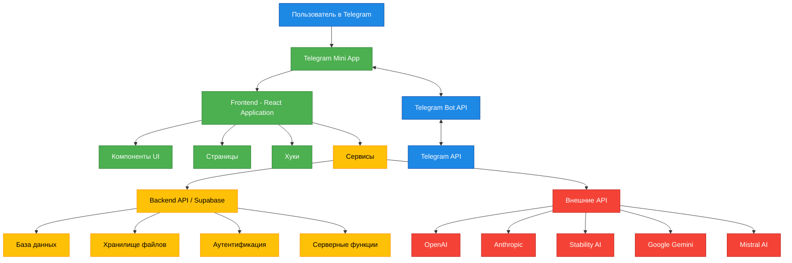
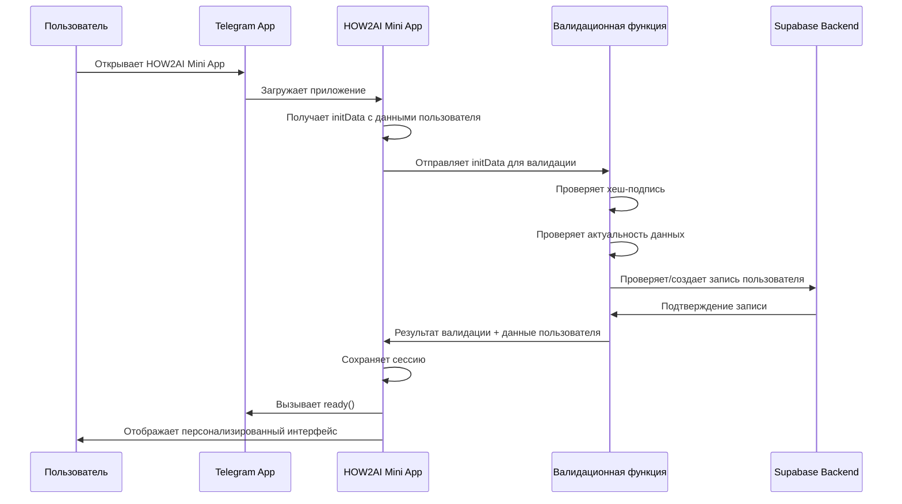
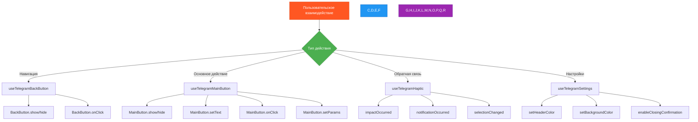
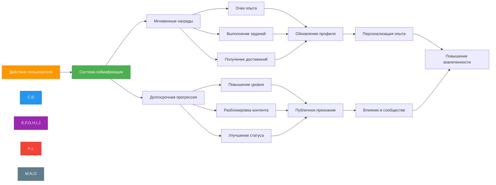
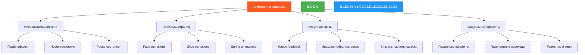
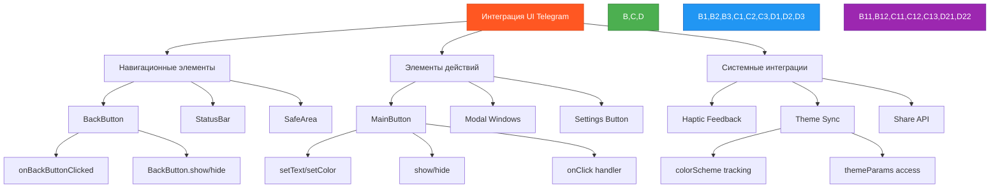
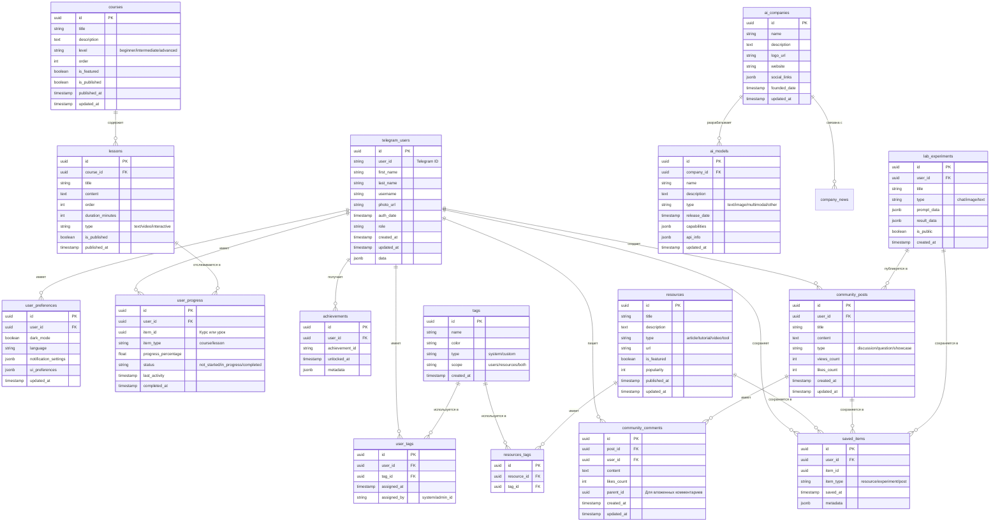

# HOW2AI Telegram Mini App - Техническая спецификация

<div style="text-align: center; margin-bottom: 30px;">
<h3>Версия 1.0</h3>
<p>Полная документация требований и спецификаций</p>
</div>

## Содержание

1. [Введение](#1-введение)
2. [Архитектура и технический стек](#2-архитектура-и-технический-стек)
3. [Интеграция с Telegram Mini App](#3-интеграция-с-telegram-mini-app)
4. [Функциональные модули](#4-функциональные-модули)
5. [Мобильно-ориентированный дизайн и UI/UX](#5-мобильно-ориентированный-дизайн-и-uiux)
6. [Администрирование и контроль](#6-администрирование-и-контроль)
7. [База данных и модели данных](#7-база-данных-и-модели-данных)
8. [Документация и управление проектом](#8-документация-и-управление-проектом)
9. [Дорожная карта разработки](#9-дорожная-карта-разработки)
10. [Приложения и ссылки](#10-приложения-и-ссылки)

## 1. Введение

### 1.1 Обзор проекта

**HOW2AI** — интерактивная образовательная платформа для изучения и взаимодействия с технологиями искусственного интеллекта, реализованная в формате Telegram Mini App. Приложение интегрируется с существующим каналом HOW2AI и ботом @how2ai_community_bot, предоставляя комьюнити энтузиастов ИИ удобный и современный интерфейс для доступа к образовательным ресурсам, экспериментальным инструментам и взаимодействия с сообществом.

### 1.2 Целевая аудитория

- **Новички в ИИ** (25-40%) — ищут структурированные знания и простые инструменты
- **Практикующие специалисты** (35-45%) — разработчики, датасаентисты, исследователи
- **Творческие профессионалы** (15-25%) — использующие ИИ для создания контента
- **Бизнес-пользователи** (10-15%) — изучающие возможности внедрения ИИ

### 1.3 Цели проекта

1. Создать единую мобильно-оптимизированную платформу для комьюнити HOW2AI в Telegram
2. Обеспечить бесшовный доступ к инструментам для работы с ИИ
3. Повысить вовлеченность и активность пользователей через геймификацию и социальные функции
4. Предоставить расширенные административные возможности для управления контентом и сообществом

## 2. Архитектура и технический стек

### 2.1 Общая архитектура



### 2.2 Технический стек

#### Frontend
- **React 18.3+** с TypeScript для структуры приложения
- **Tailwind CSS** для адаптивного дизайна
- **Framer Motion** для продвинутых анимаций и эффектов
- **Shadcn/UI** для базовых компонентов (адаптированных под Telegram)
- **React Query** для управления состоянием и кэширования

#### Backend
- **Supabase** как комплексное решение для:
  - PostgreSQL база данных
  - Аутентификация и управление сессиями
  - Edge Functions для серверной логики
  - Хранилище для медиа-контента

#### Интеграции
- **Telegram Bot API** и **Telegram WebApp API**
- API для моделей ИИ (OpenAI, Anthropic, Google, Stability AI, Mistral AI)

### 2.3 Структура проекта

```mermaid
graph TD
    A[how2ai/] --> B[public/]
    A --> C[src/]
    A --> D[scripts/]
    A --> E[docs/]
    
    C --> F[components/]
    C --> G[hooks/]
    C --> H[pages/]
    C --> I[services/]
    C --> J[utils/]
    C --> K[styles/]
    C --> L[types/]
    C --> M[contexts/]
    
    F --> N[layout/]
    F --> O[ui/]
    F --> P[laboratory/]
    F --> Q[education/]
    F --> R[community/]
    F --> S[admin/]
    F --> T[telegram/]
    
    G --> U[useTelegramApp.ts]
    G --> V[useTelegramBackButton.ts]
    G --> W[useAdminCheck.ts]
    G --> X[useLLMChat.ts]
    G --> Y[useImageGeneration.ts]
    
    E --> Z[PROJECT_OVERVIEW.md]
    E --> AA[TECHNICAL.md]
    E --> AB[USER_GUIDE.md]
    E --> AC[ADMIN_GUIDE.md]
    E --> AD[CHANGELOG.md]
    E --> AE[TASKS.md]
    
    classDef folder fill:#42A5F5,stroke:#1976D2,color:white;
    classDef file fill:#66BB6A,stroke:#388E3C,color:white;
    classDef important fill:#EF5350,stroke:#C62828,color:white;
    
    class A,B,C,D,E,F,G,H,I,J,K,L,M,N,O,P,Q,R,S,T folder;
    class U,V,W,X,Y,Z,AA,AB,AC,AD,AE file;
    class Z,AA,AD,AE important;
```



## 3. Интеграция с Telegram Mini App

### 3.1 Авторизация и безопасность



#### 3.1.1 Валидация данных Telegram WebApp

- **Обязательная хеш-проверка** для подтверждения подлинности данных
- **Временная валидация** (auth_date не старше 24 часов)
- **Защита от повторных запросов** через уникальные идентификаторы сессий
- **Шифрование чувствительных данных** при хранении

#### 3.1.2 Создание/обновление профиля пользователя

- Автоматическая синхронизация базовых данных (id, имя, фото)
- Дополнительная информация через опциональные поля
- Система ролей и привилегий (обычный пользователь, контрибьютор, модератор, администратор)

### 3.2 Telegram WebApp API интеграция

#### 3.2.1 Пользовательский интерфейс

- **Безопасные зоны экрана** (safeAreaInset) с учетом различных устройств
- **Адаптация под системную тему** Telegram (светлая/темная)
- **Кастомизация цветов заголовка и фона** через API (setHeaderColor, setBackgroundColor)

#### 3.2.2 Навигация и взаимодействие

- **Кнопка "Назад"** с интеграцией через BackButton API
- **Главная кнопка** (MainButton) с динамическим текстом и действиями
- **Индикаторы загрузки** с нативной интеграцией (showLoader, hideLoader)
- **Нативные уведомления** через hapticFeedback для тактильного отклика



### 3.3 Зачатки геймификации

#### 3.3.1 Система рейтинга и достижений

- **Очки опыта** за различные действия в приложении
- **Уровни пользователя** с визуальным отображением прогресса
- **Достижения** (badges) за выполнение определенных активностей
- **Лидерборды** с ранжированием активных участников

#### 3.3.2 Механики вовлечения

- **Ежедневные задания** с бонусами за регулярное использование
- **Цепочки активности** (streaks) для стимулирования возвращения
- **Разблокирование контента** по мере накопления опыта
- **Вознаграждения** за вклад в сообщество и образовательный процесс



## 4. Функциональные модули

### 4.1 Лаборатория ИИ

#### 4.1.1 Чат с ИИ

- Возможность выбора различных моделей (OpenAI, Claude, Gemini, Grok, Mistral)
- Мультисессионный режим с сохранением истории
- Настройка параметров (температура, токены, системный промпт)
- Экспорт результатов и сохранение шаблонов

#### 4.1.2 Генерация изображений

- Создание изображений по текстовым промптам
- Редактирование изображений через ИИ
- Библиотека стилей и пресетов
- Галерея с историей и возможностью публикации в сообществе

#### 4.1.3 Текстовая генерация

- Создание структурированных текстов различных форматов
- Инструменты редактирования и улучшения текста
- Специализированные шаблоны для разных задач
- Интеграция с мультимодальными моделями

### 4.2 Образовательные ресурсы

#### 4.2.1 Курсы и материалы

- Структурированная система курсов с прогрессом прохождения
- Интерактивные уроки с тестированием
- Библиотека ресурсов с категоризацией
- Персонализированные рекомендации на основе интересов

#### 4.2.2 Визуализации и демонстрации

- Интерактивные визуализации для понимания концепций ИИ
- Демонстрации работы алгоритмов в реальном времени
- Наглядные примеры применения ИИ в различных сферах

### 4.3 Каталог ИИ-компаний и моделей

- Структурированная база данных компаний и их продуктов
- Детальные карточки моделей с характеристиками
- Возможность сравнения моделей по различным параметрам
- Регулярные обновления и новости отрасли

### 4.4 Сообщество

- Форум по категориям с системой рейтинга комментариев
- Обмен результатами экспериментов в лаборатории
- Система репутации и вклада участников
- Персональные сообщения между пользователями

```mermaid
graph TD
    A[HOW2AI Mini App] --> B[Лаборатория ИИ]
    A --> C[Образовательные ресурсы]
    A --> D[Каталог компаний и моделей]
    A --> E[Сообщество]
    A --> F[Личный кабинет]
    
    B --> B1[Чат с ИИ]
    B --> B2[Генерация изображений]
    B --> B3[Текстовая генерация]
    
    C --> C1[Курсы и материалы]
    C --> C2[Визуализации]
    C --> C3[Библиотека ресурсов]
    
    D --> D1[Карточки компаний]
    D --> D2[Каталог моделей]
    D --> D3[Сравнение моделей]
    
    E --> E1[Форум]
    E --> E2[Обмен результатами]
    E --> E3[Репутация]
    
    F --> F1[Профиль]
    F --> F2[Достижения]
    F --> F3[Сохраненные материалы]
    F --> F4[Прогресс обучения]
    
    classDef main fill:#FF5722,stroke:#D84315,color:white;
    classDef module fill:#4CAF50,stroke:#2E7D32,color:white;
    classDef submenu fill:#2196F3,stroke:#1565C0,color:white;
    
    class A main;
    class B,C,D,E,F module;
    class B1,B2,B3,C1,C2,C3,D1,D2,D3,E1,E2,E3,F1,F2,F3,F4 submenu;
```



## 5. Мобильно-ориентированный дизайн и UI/UX

### 5.1 Принципы дизайна

#### 5.1.1 Мобильная оптимизация (Mobile-First)

- **Приоритет мобильного интерфейса** с адаптивным дизайном
- **Удобство использования одной рукой** с доступными жестами
- **Сенсорные области** не менее 44px для основных элементов
- **Оптимизация скроллинга** с предзагрузкой контента

#### 5.1.2 Адаптивный дизайн

- **Breakpoints**: xs (<576px), sm (≥576px), md (≥768px), lg (≥992px), xl (≥1200px)
- **Контейнеры с респонсивной шириной** в зависимости от устройства
- **Масштабируемая типографика** с относительными размерами
- **Оптимизация для планшетов и десктопа** без потери функциональности

#### 5.1.3 Темная тема и цветовая схема

- **Полная поддержка темной темы** с автоматической синхронизацией с Telegram
- **Основная палитра**: 
  - Темный фон: #121319 (основной), #1A1F2C (карточки)
  - Светлый фон: #F8F9FA (основной), #FFFFFF (карточки)
  - Акцентные цвета: #3B82F6 (основной), #10B981 (успех), #EF4444 (ошибка)
- **Контрастность текста** соответствует WCAG 2.1 AA

### 5.2 Продвинутые эффекты и анимации

#### 5.2.1 Микровзаимодействия

- **Тактильная обратная связь** в синхронизации с Telegram HapticFeedback
- **Визуальная реакция на тап** с эффектом рипла и изменением цвета
- **Анимация переходов** между состояниями элементов (loading, hover, focus)
- **Реакция на жесты смахивания** с прогрессивным ответом

#### 5.2.2 Анимации страниц и переходов

- **Анимация переходов между экранами** с сохранением контекста
- **Параллакс-эффекты** для создания глубины интерфейса
- **Анимация появления элементов** с каскадными эффектами
- **Плавное обновление данных** с анимацией изменений



### 5.3 Глубокая интеграция с UI Telegram

#### 5.3.1 Нативные элементы управления

- **Кнопка "Назад"** с интеграцией через BackButton API
- **Основная кнопка** внизу экрана для ключевых действий
- **Модальные окна** с поведением, аналогичным нативным
- **Кнопка настроек** в шапке приложения

#### 5.3.2 Специальные возможности Telegram Mini App

- **Интерактивные уведомления** через PopupWindow
- **Публикация результатов** в канал или чат
- **Работа в полноэкранном режиме** с учетом StatusBar и SafeArea
- **Переключение между темами** в синхронизации с Telegram



## 6. Администрирование и контроль

### 6.1 Административная панель

#### 6.1.1 Основные функции

- **Панель мониторинга** с ключевыми метриками и статистикой
- **Управление пользователями** (поиск, фильтрация, действия)
- **Управление контентом** (курсы, материалы, новости)
- **Управление настройками** приложения и функциональными модулями

#### 6.1.2 Модули административного интерфейса

```mermaid
graph TD
    A[Административная панель] --> B[Управление пользователями]
    A --> C[Управление контентом]
    A --> D[Управление настройками]
    A --> E[Аналитика и статистика]
    A --> F[Коммуникация]
    
    B --> B1[Просмотр списка пользователей]
    B --> B2[Редактирование профилей]
    B --> B3[Блокировка/разблокировка]
    B --> B4[Назначение ролей]
    B --> B5[Присвоение тегов]
    
    C --> C1[Редактирование курсов]
    C --> C2[Управление ресурсами]
    C --> C3[Обновление каталога]
    C --> C4[Публикация новостей]
    
    D --> D1[Настройки приложения]
    D --> D2[Конфигурация API]
    D --> D3[Параметры геймификации]
    D --> D4[Интеграции]
    
    E --> E1[Метрики активности]
    E --> E2[Отчеты по использованию]
    E --> E3[Конверсионные воронки]
    
    F --> F1[Рассылка сообщений]
    F --> F2[Целевые уведомления]
    F --> F3[Опросы и фидбэк]
    
    style A fill:#FF5722,stroke:#D84315,color:white
    style B,C,D,E,F fill:#4CAF50,stroke:#2E7D32,color:white
    style B1,B2,B3,B4,B5,C1,C2,C3,C4,D1,D2,D3,D4,E1,E2,E3,F1,F2,F3 fill:#2196F3,stroke:#1565C0,color:white
```



### 6.2 Управление пользователями

#### 6.2.1 Пользовательские операции

- **Просмотр детальной информации** о пользователях
- **Блокировка/разблокировка** с указанием причины
- **Назначение ролей** (пользователь, контрибьютор, модератор, администратор)
- **Сброс прогресса/достижений** при необходимости
- **Просмотр истории действий**

#### 6.2.2 Тегирование пользователей

- **Система пользовательских тегов** для сегментации аудитории
- **Автоматические теги** на основе активности и прогресса
- **Фильтрация пользователей** по тегам для операций и аналитики
- **Групповое присвоение тегов** для массовых операций

### 6.3 Управление контентом и настройками

#### 6.3.1 Редактирование контента

- **WYSIWYG-редактор** для создания и обновления материалов
- **Медиа-библиотека** для управления изображениями и видео
- **Система версионирования** для отслеживания изменений
- **Предварительный просмотр** перед публикацией

#### 6.3.2 Конфигурация системы

- **Глобальные настройки** приложения
- **API-ключи и параметры интеграции** с внешними сервисами
- **Настройки геймификации** (опыт, уровни, достижения)
- **Параметры уведомлений** и коммуникаций

### 6.4 Коммуникации и уведомления

#### 6.4.1 Массовые коммуникации

- **Рассылка сообщений** всем пользователям
- **Таргетированные уведомления** на основе сегментов и тегов
- **Планирование рассылок** с отложенной отправкой
- **Статистика доставки и открытий**

#### 6.4.2 Целевые коммуникации

- **Индивидуальные сообщения** пользователям
- **Ответы на запросы** через систему обратной связи
- **Уведомления о действиях** администратора
- **Опросы и сбор фидбэка**

## 7. База данных и модели данных

### 7.1 Схема базы данных



### 7.2 Ключевые модели данных

#### 7.2.1 Пользовательские данные

```typescript
// Структура данных пользователя Telegram
export interface TelegramUser {
  id: string;             // UUID в нашей системе
  user_id: string;        // ID пользователя в Telegram
  first_name: string;     // Имя пользователя
  last_name?: string;     // Фамилия пользователя (опционально)
  username?: string;      // Имя пользователя в Telegram (опционально)
  photo_url?: string;     // URL фотографии профиля
  auth_date: Date;        // Дата последней авторизации
  role: UserRole;         // Роль пользователя в системе
  created_at: Date;       // Дата создания записи
  updated_at: Date;       // Дата обновления записи
  data: any;              // Дополнительные данные в формате JSON
}

// Роли пользователей
export enum UserRole {
  USER = 'user',
  CONTRIBUTOR = 'contributor',
  MODERATOR = 'moderator',
  ADMIN = 'admin'
}
```

#### 7.2.2 Содержимое и функциональность

```typescript
// Курс
export interface Course {
  id: string;
  title: string;
  description: string;
  level: 'beginner' | 'intermediate' | 'advanced';
  order: number;
  is_featured: boolean;
  is_published: boolean;
  published_at?: Date;
  updated_at: Date;
  lessons?: Lesson[];
}

// ИИ-компании и модели
export interface AICompany {
  id: string;
  name: string;
  description: string;
  logo_url: string;
  website: string;
  social_links: Record<string, string>;
  founded_date?: Date;
  updated_at: Date;
  models?: AIModel[];
}

export interface AIModel {
  id: string;
  company_id: string;
  name: string;
  description: string;
  type: 'text' | 'image' | 'multimodal' | 'other';
  release_date?: Date;
  capabilities: any;
  api_info?: any;
  updated_at: Date;
}
```

#### 7.2.3 Геймификация и прогресс

```typescript
// Прогресс пользователя
export interface UserProgress {
  id: string;
  user_id: string;
  item_id: string;         // ID курса или урока
  item_type: 'course' | 'lesson';
  progress_percentage: number;
  status: 'not_started' | 'in_progress' | 'completed';
  last_activity: Date;
  completed_at?: Date;
}

// Достижения
export interface Achievement {
  id: string;
  user_id: string;
  achievement_id: string;  // Идентификатор типа достижения
  unlocked_at: Date;
  metadata: any;           // Доп. информация о достижении
}
```

## 8. Документация и управление проектом

### 8.1 Требования к документации

#### 8.1.1 Обязательная документация проекта

- **Обзор проекта** (`PROJECT_OVERVIEW.md`) с описанием целей, аудитории и ключевых функций
- **Техническая документация** (`TECHNICAL.md`) с детальным описанием архитектуры и компонентов
- **Руководство пользователя** (`USER_GUIDE.md`) с инструкциями по использованию приложения
- **Руководство администратора** (`ADMIN_GUIDE.md`) с описанием административных функций
- **Документация API** (`API_REFERENCE.md`) с перечнем эндпоинтов и моделей данных

#### 8.1.2 Ведение журнала изменений

Структурированный `CHANGELOG.md` с:
- Семантическим версионированием (MAJOR.MINOR.PATCH)
- Категоризацией изменений (Added, Changed, Deprecated, Removed, Fixed, Security)
- Датами релизов и ссылками на соответствующие задачи/issue
- Авторами и контрибьюторами новых функций

#### 8.1.3 Список задач и управление разработкой

- **Документ задач** (`TASKS.md`) с актуальным статусом разработки
- **Приоритезация** (P0-P3) и статусы задач (Not Started, In Progress, Review, Done)
- **Таймлайны** и оценки времени выполнения
- **Зависимости** между задачами и компонентами
- **Ответственные** за каждую задачу

### 8.2 Документация компонентов и кода

#### 8.2.1 Документация Frontend-компонентов

- **JSDoc/TSDoc** для функций, хуков и компонентов
- **README.md** для каждого основного модуля с описанием назначения и использования
- **Storybook** (или аналог) для визуальной документации UI-компонентов
- **Типы и интерфейсы** с подробными комментариями

#### 8.2.2 Документация Backend и API

- **Swagger/OpenAPI** спецификация для всех API эндпоинтов
- **Документация схемы базы данных** с описанием таблиц и связей
- **Примеры запросов и ответов** для каждого эндпоинта
- **Инструкции по настройке и деплою** бэкенд-инфраструктуры

### 8.3 Инструкции для разработчиков и администраторов

#### 8.3.1 Руководство для разработчиков

- **Настройка окружения** и зависимостей
- **Соглашения по кодированию** и стилю
- **Рабочий процесс** для разработки новых функций и исправления ошибок
- **Тестирование** и обеспечение качества
- **Процесс Code Review** и требования к Pull Request

#### 8.3.2 Руководство для администраторов

- **Начальная настройка** приложения и бэкенда
- **Управление пользователями** и их привилегиями
- **Модерация контента** и сообщества
- **Настройка интеграций** с внешними сервисами
- **Мониторинг и устранение проблем**

## 9. Дорожная карта разработки

### 9.1 Фаза 1: MVP (8 недель)

- **Аутентификация Telegram** с валидацией данных
- **Базовые UI-компоненты** для Telegram Mini App
- **Простой лабораторный модуль** с чатом ИИ
- **Основы каталога** ИИ-компаний и моделей
- **Базовый профиль пользователя**

### 9.2 Фаза 2: Расширение функционала (10 недель)

- **Полный функционал лаборатории** ИИ
- **Образовательные материалы** и ресурсы
- **Зачатки геймификации** и достижений
- **Административная панель** (базовый функционал)
- **Форум сообщества**

### 9.3 Фаза 3: Завершение и оптимизация (6 недель)

- **Продвинутая геймификация**
- **Расширенные административные функции**
- **Оптимизация и повышение производительности**
- **Доработки UI/UX и анимации**
- **Тестирование и исправление ошибок**

## 10. Приложения и ссылки

### 10.1 Ссылки на ресурсы

- [Документация Telegram Mini App API](https://core.telegram.org/bots/webapps)
- [Supabase Documentation](https://supabase.io/docs)
- [React + Tailwind Best Practices](https://tailwindcss.com/docs)
- [Framer Motion Animation Library](https://www.framer.com/motion/)

### 10.2 Контакты и ресурсы проекта

- **Telegram канал**: [@HOW2AI](https://t.me/how2ai)
- **Telegram бот**: [@how2ai_community_bot](https://t.me/how2ai_community_bot)
- **GitHub репозиторий**: [github.com/username/how2ai](https://github.com/username/how2ai)
- **Документация проекта**: [docs.how2ai.com](https://docs.how2ai.com)
